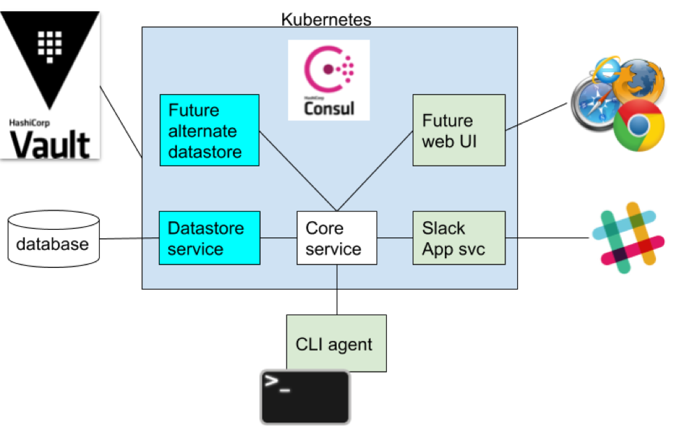

# Skillitor
Modular skill-tracking microservice

## Intra-service Communication


We’ll use gRPC to define the message protocol between any microservices. This will allow us to have a well-defined service interface that we can generate server/client code for automatically, and we can use any programming language. There is also a grpc-web Javascript library for web clients.

To communicate with Slack, you can define slash commands and then specify a HTTP endpoint to which Slack will POST whatever was entered after the command. We built an API gateway in Python that relays information between Slack (HTTP) and skillitor-core (gRPC).

Consul provides service discovery, and secure communication between services.



### Features & Functionality
Keep track of people, their skills, and an optional skill experience level.
Accept a message from an agent to set a skill/level for a person.
Accept a message from an agent requesting to search for all people having one or more skills and returning the result.

**Skill levels**

Beginner: A novice understanding of the skill. You have exposure to the skill and understand its basic concepts but lack experience. 
Intermediate: Between a beginner and an expert. You have experience with and can carry out the skill but don't understand its advanced concepts. 
Advanced: A highly developed skill level. You have solid experience and training with the skill and understand advanced concepts. You demonstrate proficiency and superior skill level.


###Prequisites
A Slack accoujnt

### Installing

A step by step series of examples that tell you how to get a development env running

Say what the step will be

```
Give the example
```

And repeat

```
until finished
```

```

## Deployment
